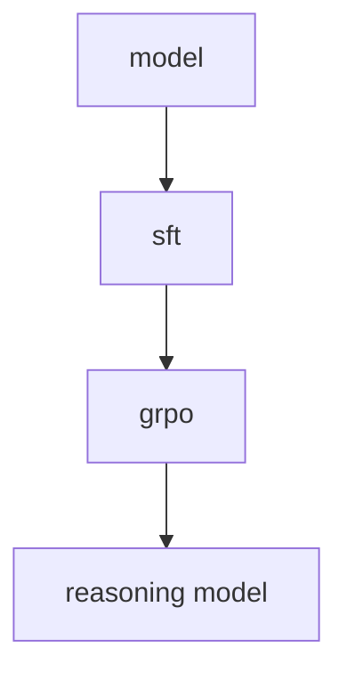

# Agent Gym


[](https://discord.gg/swarms) [](https://www.youtube.com/@kyegomez3242) [](https://www.linkedin.com/in/kye-g-38759a207/) [](https://x.com/kyegomezb)

Convert any model into a r1-like reasoning hyper-intelligent agent. Leverages TRL, Huggingface, and various other libraries. This is a work in progress. Our goal is to make it easy to train any model into a reasoning agent.


- Sources:
- [Open R1 Blog](https://huggingface.co/blog/open-r1)
- [GRPO Documentation from trl](https://huggingface.co/docs/trl/main/en/grpo_trainer)
- [Huggingface Docs](https://huggingface.co/docs/transformers/main/en/index)
- [GRPO Docs](https://huggingface.co/docs/trl/main/en/grpo_trainer)


## Installation

```bash
pip3 install -U agentgym
```

## Usage

```python
from agentgym.r1_pipeline import R1Pipeline, SFTConfig

r1_pipeline = R1Pipeline(sft_model="gpt2", sft_dataset="stanfordnlp/imdb", sft_args=SFTConfig(output_dir="/tmp"))

r1_pipeline.run()
```

## Architecture

The architecture is as follows:

- SFT: Supervised Fine-Tuning
- GRPO: Generative Reinforcement Policy Optimization

-> model -> sft -> grpo -> model



# License
MIT
