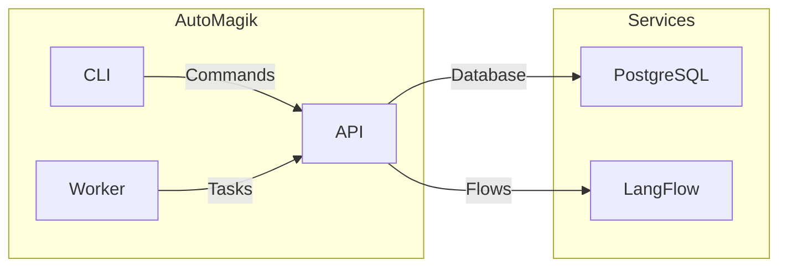

# AutoMagik

<p align="center">
  
</p>

Because magic shouldn't be complicated.

AutoMagik is a workflow automation system that lets you run AI-driven flows from [LangFlow](https://github.com/logspace-ai/langflow) with minimal fuss. Deploy tasks, monitor them, and iterate quickly—without writing a bunch of code.

---

## Quick Setup

The easiest way to get started with AutoMagik is using our setup script. This will automatically set up all required services including PostgreSQL, the API, worker, and optionally LangFlow.

### Prerequisites

- Linux-based system (Ubuntu/Debian recommended)
- Git (to clone the repository)
- Python 3.10 or higher (will be installed automatically on Ubuntu/Debian if not present)
- Docker and Docker Compose (will be installed automatically on Ubuntu/Debian if not present)

### One-Command Setup

1. Clone the repository:
   ```bash
   git clone https://github.com/namastexlabs/automagik.git
   cd automagik
   ```

2. Run the setup script:
   ```bash
   ./scripts/setup_local.sh
   ```

That's it! The script will:
- Create necessary environment files
- Install Docker if needed (on Ubuntu/Debian)
- Set up all required services
- Install the CLI tool (optional)
- Guide you through the entire process

Once complete, you'll have:
- AutoMagik API running at <http://localhost:8888>
- PostgreSQL database at `localhost:15432`
- Worker service running and ready to process tasks
- LangFlow UI at <http://localhost:17860> (if installed)
- CLI tool installed in a virtual environment (if chosen)

### Verify Installation

The setup script automatically verifies all services. You can also check manually:

```bash
# Check API health
curl http://localhost:8888/health

# Access API documentation
open http://localhost:8888/api/v1/docs  # Interactive Swagger UI
open http://localhost:8888/api/v1/redoc # ReDoc documentation

# List flows (if CLI is installed)
source .venv/bin/activate
automagik flow list
```

### What's Included

- **API Server**: Handles all HTTP requests and core logic
- **Worker**: Processes tasks and schedules
- **Database**: PostgreSQL with all required tables automatically created
- **LangFlow** (optional): Visual flow editor for creating AI workflows
- **CLI Tool** (optional): Command-line interface for managing flows and tasks

### Development Setup

For development, use the development setup script instead:

```bash
./scripts/setup_dev.sh
```

This will:
- Set up a development environment with additional tools
- Configure git hooks for code quality
- Install development dependencies
- Use development-specific configurations

### Environment Configuration

The setup creates two main environment files:
- `.env`: Your local configuration
- `.env.example`: Template for reference

Key environment variables:
- `AUTOMAGIK_API_KEY`: API authentication key
- `DATABASE_URL`: PostgreSQL connection string
- `LANGFLOW_API_URL`: LangFlow instance URL
- `AUTOMAGIK_DEBUG`: Enable debug mode (0/1)
- `LOG_LEVEL`: Logging verbosity (DEBUG/INFO/WARNING/ERROR)

### Project Structure



- **API**: Core service handling requests and business logic
- **Worker**: Processes tasks and schedules
- **CLI**: Command-line tool for managing flows and tasks
- **PostgreSQL**: Stores flows, tasks, schedules, and other data
- **LangFlow**: Optional service for creating and editing flows

### Using the CLI

AutoMagik comes with a powerful CLI tool for managing flows, tasks, and schedules. Here are some common commands:

#### Flow Management
```bash
# List all flows
automagik flow list

# View flow details
automagik flow view FLOW_ID

# Sync a flow from LangFlow
automagik flow sync FLOW_ID

# Delete a flow
automagik flow delete FLOW_ID
```

#### Task Management
```bash
# List all tasks
automagik task list

# Create a new task
automagik task create FLOW_ID --input '{"key": "value"}'

# View task details
automagik task view TASK_ID

# Retry a failed task
automagik task retry TASK_ID
```

#### Schedule Management
```bash
# List all schedules
automagik schedule list

# Create a schedule (runs daily at midnight)
automagik schedule create FLOW_ID "0 0 * * *"

# Update schedule expression
automagik schedule set-expression SCHEDULE_ID "*/15 * * * *"

# Enable/disable a schedule
automagik schedule update SCHEDULE_ID --enabled true

# Delete a schedule
automagik schedule delete SCHEDULE_ID
```

#### API and Worker Management
```bash
# Start the API server
automagik api

# Start the worker
automagik worker start

# Stop the worker
automagik worker stop

# Check worker status
automagik worker status
```


### API Endpoints

The API is organized under the `/api/v1` prefix and includes these main endpoints:

- **Flows**: `/api/v1/flows`
  - `GET /api/v1/flows`: List all flows
  - `POST /api/v1/flows`: Create a new flow
  - `GET /api/v1/flows/{id}`: Get flow details
  - `DELETE /api/v1/flows/{id}`: Delete a flow

- **Tasks**: `/api/v1/tasks`
  - `GET /api/v1/tasks`: List all tasks
  - `POST /api/v1/tasks`: Create a new task
  - `GET /api/v1/tasks/{id}`: Get task details
  - `POST /api/v1/tasks/{id}/run`: Run a task

- **Schedules**: `/api/v1/schedules`
  - `GET /api/v1/schedules`: List all schedules
  - `POST /api/v1/schedules`: Create a schedule
  - `GET /api/v1/schedules/{id}`: Get schedule details
  - `DELETE /api/v1/schedules/{id}`: Delete a schedule

For full API documentation, visit:
- Swagger UI: <http://localhost:8888/api/v1/docs>
- ReDoc: <http://localhost:8888/api/v1/redoc>

### Logs and Monitoring

- API logs: Available through Docker Compose logs
- Worker logs: Configured via `AUTOMAGIK_WORKER_LOG` (default: `logs/worker.log`)
- Database logs: Available through Docker Compose logs

View all logs:
```bash
docker compose -p automagik -f docker/docker-compose.yml logs -f
```

### Stopping Services

To stop all services:
```bash
docker compose -p automagik -f docker/docker-compose.yml down
```

### Next Steps

1. If you installed LangFlow, visit <http://localhost:17860> to create your first flow
2. Use the API at <http://localhost:8888/api/v1/docs> to manage your flows and tasks
3. Try out the CLI commands with `automagik --help`
4. Monitor task execution through logs and API endpoints

For more detailed documentation, check out the `docs/` directory.
