# 🌀 blue-assistant

🌀 `@assistant` is an AI assistant.

```bash
pip install blue-assistant
```

```mermaid
graph LR
    assistant_script_run["@assistant<br>script<br>run -<br>&lt;object-name&gt;"]

    object["📂 object"]:::folder

    object --> assistant_script_run
    assistant_script_run --> object

    classDef folder fill:#999,stroke:#333,stroke-width:2px;
```



---


[](https://github.com/kamangir/blue-assistant/actions/workflows/pylint.yml) [](https://github.com/kamangir/blue-assistant/actions/workflows/pytest.yml) [](https://github.com/kamangir/blue-assistant/actions/workflows/bashtest.yml) [](https://pypi.org/project/blue-assistant/) [](https://pypistats.org/packages/blue-assistant)

built by 🌀 [`blue_options-4.207.1`](https://github.com/kamangir/awesome-bash-cli), based on 🌀 [`blue_assistant-4.32.1`](https://github.com/kamangir/blue-assistant).
