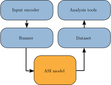

---
jupytext:
  formats: md:myst
  text_representation:
    extension: .md
    format_name: myst
    format_version: 0.13
    jupytext_version: 1.16.4
kernelspec:
  display_name: Python 3 (ipykernel)
  language: python
  name: python3
---

(cmdline)=

# Command-line tools

In addition to the Python API, flatspin comes with a set of powerful command-line tools.
These are installed automatically as part of the flatspin package.

If you find that the commands are not available in your shell automatically, you may need to modify your `PATH` variable.
The location of the command-line tools varies based on the operating system and installation method.

If you installed flatspin in your home directory (using `pip install --user`):

```bash
export PATH=$PATH:$HOME/.local/bin
```

The command-line tools can be understood from the flatspin architecture:



In the figure, the arrows indicate data flow between the components:
1. The [input encoder](encoders) translates input to a field protocol (series of external fields).
2. The *runner* perturbs the [ASI model](model) according to the field protocol, and saves the results.
3. The results are stored in a [dataset](datasets)
4. Analysis tools read and process the [dataset](datasets).

```{note}
A good understanding of the concepts introduced in the rest of this User Guide is beneficial to effectively use the command-line tools.
```

+++

(cmdline-running)=
## Running simulations

flatspin simulations can be run directly from the command line, using the commands [`flatspin-run`](flatspin-run) and [`flatspin-run-sweep`](flatspin-run-sweep).
These tools were designed to be flexible enough to allow for a range of different simulation scenarios.

Some notable features include:

- Results are stored in the standard [dataset format](dataset) for later analysis.
- All simulation parameters can be specified from the command-line.
- [Input encoders](encoders) are used to define the external field.
- Parameter sweeps can be defined to run many simulations in one go.
- Simulations may be run in parallel on a compute cluster.

+++

(cmdline-flatspin-run)=
### [`flatspin-run`](flatspin-run)

To run a single flatspin simulation, use [`flatspin-run`](flatspin-run).

Let us start with a simple example:

(cmdline-run-simple)=
```bash
flatspin-run -o /tmp/flatspin/myrun -m SquareSpinIceClosed \
             -e Triangle -p H=100e-3 -p phase=-90 -p phi=30 -p periods=1
```

```{code-cell} ipython3
:tags: [remove-input]

%%bash
export PYTHONWARNINGS="ignore:Ignoring unknown parameters::flatspin.runner"
rm -rf /tmp/flatspin/myrun
flatspin-run -o /tmp/flatspin/myrun -m SquareSpinIceClosed \
              -e Triangle -p H=100e-3 -p phase=-90 -p phi=30 -p periods=1
```

The `-o/--basepath` argument specifies the directory where simulation results will be stored as a [dataset](dataset).
This directory should not already exist, and will be automatically created by [`flatspin-run`](flatspin-run).

The `-m/--model` argument refers to the [model class](model) to use.
You may also specify your own model class by providing the full module path, e.g., `-m mymodels.MySpinIce`.

The `-e/--encoder` argument specifies the [input encoder](encoders) to use for defining the field protocol.
In the example, the `Triangle` encoder is used which results in a linear ramped external field.
For a list of available encoders, see `flatspin-run --list-encoders`.
You may also specify your own encoder class by providing the full module path, e.g., `-e myencoders.MyEncoder`.

The `-p/--param` arguments are parameters to the model, the runner and the encoder:
* `-p H=100e-3` sets the amplitude of the external field to 100 mT
* `-p phase=-90` sets the phase of the triangle wave to -90°
* `-p phi=30` sets the angle of the external field to 30°
* `-p periods=1` sets the number of field cycles to 1

For a list of available parameters, append `--list-params` to the [`flatspin-run`](flatspin-run) command.

+++

### The runner

The {func}`runner <flatspin.runner>` is responsible for running the simulation.
In simplified pseudocode, the runner does the following:

```
model = ModelClass(model_params)
encoder = EncoderClass(encoder_params)
h_ext = encoder(input)
for h in h_ext:
    model.set_h_ext(h)
    model.relax()
    if should_sample:
        record current state of the model
save recorded states as tables in the dataset
```

As you can see, the external field is what drives the simulation.
Each value of `h_ext` is immediately followed by a call to {func}`model.relax() <flatspin.model.SpinIce.relax>`, which flips any spins in response to the new field value.

(cmdline-params)=
### Parameters

The parameters passed by the `-p/--param` arguments are consumed in the following order:
1. The model class (passed to the constructor)
2. The runner (passed to {func}`flatspin.runner.run`)
3. The encoder class (passed to {func}`Encoder.set_params() <flatspin.encoder.Encoder.set_params>`

It is assumed that there is never overlap between the parameter names for the model, runner and encoders.

For a list of available parameters, append `--list-params` to the [`flatspin-run`](flatspin-run) command.
Documentation for each parameter can be found in the {class}`model class <flatspin.model.SpinIce>`, the {func}`runner <flatspin.runner.run>` and the corresponding encoder class {mod}`flatspin.encoder`.

Parameter values are evaluated as Python code (using [eval](https://docs.python.org/3/library/functions.html#eval)).
Values may use numpy code, e.g., `-p param=np.random.rand()`.
Some additional utility functions are also available, see {data}`flatspin.cmdline.param_globals`.

### Input

The `input` to the encoder may provided in a few different ways:
1. Passed directly as an array: `-p input=[0.3, 0.5, 1.0]`
2. Created indirectly: `-p periods=P` which is short-hand for `-p input=[1]*P`
3. Loaded from file: `-p input=myinput.csv` which is read with {func}`read_table() <flatspin.data.read_table>`.
   To select a specific column to use:  `-p input_key=column_name`.

### Selecting the sample rate: `spp` and `timesteps`

The [encoder](encoders) may produce many `h_ext` values for each `input` value.
The number of `h_ext` values is typically controlled by the `timesteps` [encoder parameter](encoders-params).
For example, the `Triangle` encoder uses `timesteps=100` by default, meaning there will be 100 `h_ext` field values per `input` value.

The `spp` runner parameter determines how often the state of the model should be sampled (and saved).
The parameter name `spp` is an abbreviation for *samples per period*, and specifies the number samples per input period.
In the `Triangle` example, we can use `-p spp=100` to sample the model state after every `h_ext` value, or
`-p spp=50` to sample every other `h_ext` value, or `-p spp=1` to sample once for each `input` value (sampled at the beginning of the input).

Some care must be taken when choosing `spp` such that it is compatible with `timesteps`.
It is the users responsibility to ensure that `spp` evenly divides `timesteps` (a warning is generated if it does not).

(cmdline-params-t)=
### Time-varying parameters

Some model parameters may also be modified dynamically over time.
Time-varying parameters can be defined by adding a `_t` suffix to the parameter name, for example:

```bash
flatspin-run ... -p temperature_t='[400, 350, 300]'
```

will create a time-varying temperature with three values.
The length of all time-varying parameters *must match the length of the `input`*.

Currently, the following time-varying parameters are supported:
`alpha_t`, `hc_t`, `m_therm_t`, `spin_t`, `temperature_t`, `therm_timescale_t`, `threshold_t`
The external field must be created using the input encoder, i.e., `h_ext_t` is not allowed.

+++

(cmdline-flatspin-run-sweep)=
### [`flatspin-run-sweep`](flatspin-run-sweep)

Often we wish to explore how an ASI changes behavior under different parameters.
Parameter sweeps is a simple and effective way to systematically explore the effect of one or multiple parameters.

[`flatspin-run-sweep`](flatspin-run-sweep) accepts a list of parameters to sweep, and runs a series of flatspin simulations using the given parameter values.
Continuing our [simple example](cmdline-run-simple), we sweep the field strength `H`:

(cmdline-run-sweep)=
```bash
flatspin-run-sweep -o /tmp/flatspin/mysweep -m SquareSpinIceClosed \
                   -e Triangle -p phase=-90 -phi=30 -p periods=1 \
                   -s 'H=[80e-3, 84e-3, 88e-3, 92e-3]'
```

```{code-cell} ipython3
:tags: [remove-input]

%%bash
export PYTHONWARNINGS="ignore:Ignoring unknown parameters::flatspin.runner"
rm -rf /tmp/flatspin/mysweep
flatspin-run-sweep -o /tmp/flatspin/mysweep -m SquareSpinIceClosed \
                   -e Triangle -p phase=-90 -p phi=30 -p periods=1 \
                   -s 'H=[80e-3, 84e-3, 88e-3, 92e-3]'
```

The `-s/--sweep` argument in the above command specifies a sweep of the parameter `H` with a list of values ranging from 80 mT to 92 mT.

Note how the invocation of [`flatspin-run-sweep`](flatspin-run-sweep) is identical to [`flatspin-run`](flatspin-run), with the addition of `-s/--sweep`.

Multiple parameters may be swept by providing multiple `-s/--sweep` arguments, in which case all combinations of parameter values will be swept.

For example, the command:

```bash
flatspin-run-sweep ... -s 'phi=[0, 30, 45]' -s 'H=[80e-3, 84e-3, 88e-3, 92e-3]'
```

would sweep the two parameters `phi` and `H`, starting with `phi=0, H=80e-3`, then `phi=0, H=84e-3`, and so on until finally `phi=45, H=92e-3` is reached.
The above sweep would result in a total of 12 flatspin runs.

In addition, each run may be repeated `N` times with `-n/--repeat N`.
This is useful when simulating stochastic systems, e.g., with [disorder](model-hc) or [thermal fields](fields-thermal) enabled.

+++

### Distributed running

As the number of parameters grow, it may be beneficial to distribute the simulations onto a compute cluster to run them in parallel.
Distributed running is supported both by [`flatspin-run`](flatspin-run) and [`flatspin-run-sweep`](flatspin-run-sweep) with the `-r dist` argument.

flatspin uses [SLURM](https://slurm.schedmd.com/) to submit cluster jobs.
Currently you need to edit the file `flatspin.slurm.sh` to configure flatspin for your particular cluster.
Other job schedulers should be possible with minimal code changes.

+++

## Analysis tools

A set of analysis tools are included in flatspin, which all operate on datasets such as those produced by [`flatspin-run`](flatspin-run) and [`flatspin-run-sweep`](flatspin-run-sweep).

+++

### [`flatspin-inspect`](flatspin-inspect)

[`flatspin-inspect`](flatspin-inspect) is a handy tool to quickly get an overview of the contents of a dataset.

For example, let us have a look at the [sweep we created above](cmdline-run-sweep):

```bash
flatspin-inspect -b /tmp/flatspin/mysweep -l
```

```{code-cell} ipython3
:tags: [remove-input]

%%bash
flatspin-inspect -b /tmp/flatspin/mysweep -l
```

The output of `flatspin-inspect -l` consists of three parts:

1. Parameter listing `params`: A list of all the parameters used in the run.
   Notice how this listing contains parameters that were not specified in the [`flatspin-run-sweep`](flatspin-run-sweep) command.
   These parameters record the default values at the dataset creation time.
2. Information `info`: Miscellaneous information about the run, including the full [`flatspin-run-sweep`](flatspin-run-sweep) command.
3. The `index` of the runs in the dataset: the index contains one column for each swept parameter.

```{tip}
If the `-b/--datapath` argument is omitted, the flatspin analysis tools will look for a dataset in the current working directory.
```

+++

### Tables included in a run
Let us have a look at what tables are available within each run:

```bash
flatspin-inspect -b /tmp/flatspin/mysweep
```

```{code-cell} ipython3
:tags: [remove-input]

%%bash
flatspin-inspect -b /tmp/flatspin/mysweep
```

From the output above, we can see that each run in the dataset contains quite a few tables.
Tables marked with a `[t]` contain time-dependent data.
Below is a short description of the tables, with references to the releated model attributes or methods.

| Table      | Description |
| ---------- | ----------- |
| `energy`   | [Energy](analysis-energy) over time |
| `geometry` | [Position and angle](model-geometry) of each spin |
| `h_ext`    | [External field](fields-external) over time |
| `h_therm`  | [Thermal field](fields-thermal) over time (if `temperature > 0`) |
| `hc`       | [Coercive fields](model-hc) of each spin |
| `init`     | [Initial state](model-spin) of each spin |
| `input`    | [Input](encoders-input) over time |
| `mag`      | [Magnetization vectors](model-vectors) over time |
| `params`   | [Parameter](cmdline-params) listing |
| `params_t` | [Time-varying parameters](cmdline-params-t) over time (if any) |
| `spin`     | [Spin state](model-spin) over time |
| `stats`    | Run statistics |
| `steps`    | Cumulative number of [steps](dynamics-step) over time |

+++

### Subset and filter

Just like the [flatspin dataset API](dataset-subset), we can select a subset of the dataset with `-i/--subset` or `-s/--filter`:

```bash
flatspin-inspect -b /tmp/flatspin/mysweep -i 1:2
```

```{code-cell} ipython3
:tags: [remove-input]

%%bash
flatspin-inspect -b /tmp/flatspin/mysweep -i 1:2
```

```bash
flatspin-inspect -b /tmp/flatspin/mysweep -s H=0.084
```

```{code-cell} ipython3
:tags: [remove-input]

%%bash
flatspin-inspect -b /tmp/flatspin/mysweep -s H=0.084
```

In fact, all the flatspin analysis tools support a common set of command-line options, such as `-i/--subset`, `-s/--filter` and `-l/--list`.

+++

### [`flatspin-plot`](flatspin-plot)

For quickly plotting data from a dataset, [`flatspin-plot`](flatspin-plot) is your friend.

Let us plot the external field over time from the `myrun` dataset created earlier:

```bash
flatspin-plot -b /tmp/flatspin/myrun -x t -y h_ext
```

```{code-cell} ipython3
:tags: [remove-cell]

%%bash
mkdir -p images/generated
flatspin-plot -b /tmp/flatspin/myrun -x t -y h_ext -o images/generated/myrun_h_ext.svg
```


+++

Similarly, we can plot data from multiple runs:

```bash
flatspin-plot -b /tmp/flatspin/mysweep -k H -x t -y h_ext
```

```{code-cell} ipython3
:tags: [remove-cell]

%%bash
flatspin-plot -b /tmp/flatspin/mysweep -k H -x t -y h_ext -o images/generated/mysweep_h_ext.svg
```


+++

Plot everything from a given table with `-g/--table`:

```bash
flatspin-plot -b /tmp/flatspin/myrun -x t -g energy
```

```{code-cell} ipython3
:tags: [remove-cell]

%%bash
flatspin-plot -b /tmp/flatspin/myrun -x t -g energy -o images/generated/myrun_energy.svg
```


+++

Rudimentary functions are also supported, e.g., to sum of all the spins over time:

```bash
flatspin-plot -b /tmp/flatspin/mysweep -k H -x t -y 's=sum(spin*)'
```

```{code-cell} ipython3
:tags: [remove-cell]

%%bash
flatspin-plot -b /tmp/flatspin/mysweep -k H -x t -y 's=sum(spin*)' -o images/generated/mysweep_spin.svg
```


+++

... or the same data plotted as a heatmap:

```bash
flatspin-plot -b /tmp/flatspin/mysweep -k H -x t -z 's=sum(spin*)'
```

```{code-cell} ipython3
:tags: [remove-cell]

%%bash
flatspin-plot -b /tmp/flatspin/mysweep -k H -x t -z 's=sum(spin*)' -o images/generated/mysweep_spin_heatmap.svg
```


+++

Arbitrary columns may be used on the x-axis:

```bash
flatspin-plot -b /tmp/flatspin/myrun -x 'mx=sum(mag*x)' -y 'my=sum(mag*y)'
```

```{code-cell} ipython3
:tags: [remove-cell]

%%bash
flatspin-plot -b /tmp/flatspin/myrun -x 'mx=sum(mag*x)' -y 'my=sum(mag*y)' -o images/generated/myrun_mxmy.svg
```


+++

See `flatspin-plot --help` for a full list of options.

+++

### [`flatspin-vectors`](flatspin-vectors)

Use [`flatspin-vectors`](flatspin-vectors) to animate spin vectors over time.
The time steps to include can be limited using `-t start:stop:step`.
In the command below we include all time steps, and draw vectors as arrows.

```bash
flatspin-vectors -b /tmp/flatspin/myrun -t ::1 --style=arrow
```

```{code-cell} ipython3
:tags: [remove-cell]

%%bash
flatspin-vectors -b /tmp/flatspin/myrun -t ::1 --style=arrow -o images/generated/myrun.gif
```

```{image} images/generated/myrun.gif
:width: 480px
```

+++

It is often useful to compare results from multiple runs.
When the dataset contains multiple runs, [`flatspin-vectors`](flatspin-vectors) animates them side by side in a *montage*:

```bash
flatspin-vectors -b /tmp/flatspin/mysweep -t ::1 --style=arrow
```

```{code-cell} ipython3
:tags: [remove-cell]

%%bash
flatspin-vectors -b /tmp/flatspin/mysweep -t ::1 --style=arrow -o images/generated/mysweep.gif
```

```{image} images/generated/mysweep.gif
:width: 480px
```

+++

It is also possible to create a *montage over time*, where each image corresponds to the same run at different points in time.
Montage over time is enabled with `-a/--animate-dataset`.
When the images become small, it is a good idea to use the default `--style=image`, which results in a grid based visualization instead.

```bash
flatspin-vectors -b /tmp/flatspin/myrun -t ::1 -a
```

```{code-cell} ipython3
:tags: [remove-cell]

%%bash
flatspin-vectors -b /tmp/flatspin/myrun -t ::1 -a -o images/generated/myrun_time.gif
```

```{image} images/generated/myrun_time.gif
:width: 480px
```

+++

By default, [`flatspin-vectors`](flatspin-vectors) animates the spin vectors, but other quantities can be specified with `-q/--quantity`:

```bash
flatspin-vectors -b /tmp/flatspin/myrun -t ::1 --style=arrow -q h_ext
```

```{code-cell} ipython3
:tags: [remove-cell]

%%bash
flatspin-vectors -b /tmp/flatspin/myrun -t ::1 --style=arrow -q h_ext -o images/generated/myrun_h_ext.gif
```

```{image} images/generated/myrun_h_ext.gif
:width: 480px
```

+++

#### Apply a grid
A [grid](analysis-grid) may be applied to the vectors to produce an aggregate view with `-g/--grid`.
Below we apply a `2x2` grid and sum the vectors in each grid cell:

```bash
flatspin-vectors -b /tmp/flatspin/myrun -t ::1 -a -g 2
```

```{code-cell} ipython3
:tags: [remove-cell]

%%bash
flatspin-vectors -b /tmp/flatspin/myrun -t ::1 -a -g 2 -o images/generated/myrun_grid.gif
```

```{image} images/generated/myrun_grid.gif
:width: 480px
```

+++

The different color shades in the images above are caused by each grid cell having a different number of spins.
For the square closed geometry, we can obtain vertex magnetization by first cropping away the spins at the edges (`-c/--crop 1`), and then apply a sliding 3x3 window with a step size of 2 (`-w/--window 3 2`):

```bash
flatspin-vectors -b /tmp/flatspin/myrun -t ::1 -a -c 1 -w 3 2
```

```{code-cell} ipython3
:tags: [remove-cell]

%%bash
flatspin-vectors -b /tmp/flatspin/myrun -t ::1 -a -c 1 -w 3 2 -o images/generated/myrun_window.gif
```

```{image} images/generated/myrun_window.gif
:width: 480px
```

+++

For other geometries, the above windowing trick may not be applicable to find vertices.
The [`flatspin-vertices`](flatspin-vertices) tool is similar to [`flatspin-vectors`](flatspin-vectors), but employs [vertex detection](analysis-vertex-detection) to correctly visualize vertex magnetization for all the included geometries.

+++

## Other tools

In this guide, we have introduced some of the most commonly used command-line tools in flatspin.
Several other tools are included, available with the [`flatspin-`](flatspin-) prefix.
For a full list of command-line tools, see [](reference/cmdline).
