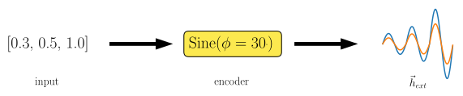

---
jupytext:
  formats: md:myst
  text_representation:
    extension: .md
    format_name: myst
    format_version: 0.13
    jupytext_version: 1.11.5
kernelspec:
  display_name: Python 3
  language: python
  name: python3
---

```{code-cell} ipython3
:tags: [remove-input]

%config InlineBackend.figure_formats = ['svg']

import numpy as np
from numpy.linalg import norm
import matplotlib.pyplot as plt
plt.rcParams['animation.frame_format'] = "svg"
```

(encoders)=

# Input encoders

flatspin input encoders translate a set of input values to a series of external fields.
Encoders provide a flexible way to define field protocols.
A range of encoders are included, e.g., sinusoidal, sawtooth and rotational fields.

The figure below illustrates the operation of an input encoder.
A set of three input values are input to the encoder, which translates the values to an external field $\vec{h}_{ext}^{(i)}$.



+++

## A simple example

In the code sample below, we use the {class}`Sine <flatspin.encoder.Sine>` encoder, which encodes input as the amplitude of a sinusoidal field, applied at a fixed angle (here 30°).
After an encoder has been created, it can be called to encode an `input` to a series of `h_ext` values.

```{code-cell} ipython3
from flatspin.encoder import Sine

encoder = Sine(phi=30)
input = [0.3, 0.5, 1.0]
h_ext = encoder(input)
print(f"h_ext.shape = {h_ext.shape}")

plt.title(str(encoder))
plt.plot(h_ext[:,0], label="h_ext[0]")
plt.plot(h_ext[:,1], label="h_ext[1]")
plt.xlabel("t")
plt.legend();
```

(encoders-input)=
## Input

Input values should generally be in the range \[0, 1\] and take the form of a 1D or 2D array.
A 1D array is simply a series of values, whereas a 2D array is a series of n-dimensional input vectors.
Thus the shape of the `input` array is `(num_inputs, input_dim)` where `input_dim` is the input dimensionality (number of values per input).
Passing an 1D array is equivalent to a 2D array with shape `(num_inputs, 1)`.

+++

## Output

The output of an encoder is an array `h_ext` of external fields over time.
Encoders can produce two different types of external fields:

1.  A global time-dependent field: `h_ext.shape = (time, 2)`
2.  A spatial time-dependent field: `h_ext.shape = (time, height, width, 2)`

The first dimension of `h_ext` is the timestep, i.e., `h_ext[t]` is the field at timestep `t`.
The last dimension of `h_ext` is always `2` (a 2D vector).
Spatial fields are defined on a grid, and the two extra dimensions `height` and `width` define the number of grid cells in the vertical and horizontal direction, respectively.

The type of `h_ext` produced depends on the particular encoder.
Encoders with `Grid` in the name will generally produce a spatial field.

Global time-dependent fields can be passed to a model using {func}`set_h_ext(h_ext[t]) <flatspin.model.SpinIce.set_h_ext>`, while spatial time-dependent fields can be used with {func}`set_h_ext_grid(h_ext[t]) <flatspin.model.SpinIce.set_h_ext_grid>`.

+++

(encoders-params)=
## Encoder parameters

Just like [model objects](), encoders take a set of parameters.
In the simple example above, we set the parameter `phi=30` during initialization.
Parameters may also be changed after an encoder has been created, by calling {func}`set_param() <flatspin.encoder.Encoder.set_param>` or {func}`set_params() <flatspin.encoder.Encoder.set_params>`:

```{code-cell} ipython3
# Change some encoder parameters
encoder.set_params(H0=0.01, H=0.02, timesteps=16)

h_ext = encoder(input)
print(f"h_ext.shape = {h_ext.shape}")

plt.title(str(encoder))
plt.plot(h_ext[:,0], label="h_ext[0]")
plt.plot(h_ext[:,1], label="h_ext[1]")
plt.legend();
```

In the code above, we changed the parameters `H0` and `H`, which define the minimum and maximum amplitude of the sine wave, respectively.
That is, input values between `0` and `1` are mapped linearly to the range `H0` - `H`.
We also changed the time resolution of each period of the sine wave with the `timesteps` parameter.

+++

{class}`Triangle <flatspin.encoder.Triangle>` is another useuful encoder, e.g., for setting up a linear hystersis loop:

```{code-cell} ipython3
from flatspin.encoder import Triangle

encoder = Triangle(H=0.1, phi=40)
input = [1]
h_ext = encoder(input)

plt.title(str(encoder))
plt.plot(h_ext[:,0], label="h_ext[0]")
plt.plot(h_ext[:,1], label="h_ext[1]")
plt.legend();
```

## Visualizing `h_ext`

Often, the output of an encoder is more easily visualized by animating the vectors.

```{code-cell} ipython3
:tags: [hide-input]

from matplotlib.animation import FuncAnimation
from matplotlib import ticker
from IPython.display import HTML
from flatspin.plotting import plot_vectors
import textwrap

def animate_h_ext(h_ext, title="", interval=100, cmap='rainbow'):
    fig, ax = plt.subplots()
    
    # Axes setup
    ax.set_title(textwrap.fill(title))
    ax.xaxis.set_major_locator(ticker.MultipleLocator(1))
    ax.yaxis.set_major_locator(ticker.MultipleLocator(1))
    ax.tick_params(bottom=False, left=False, labelbottom=False, labelleft=False)

    # Normalize vectors to unit length
    nmax = np.max([norm(h_ext.reshape((-1,2)), axis=-1)])
    if nmax != 0:
        h_ext /= nmax

    # Positions of vectors
    if len(h_ext.shape) == 4:
        # Spatial field
        xx, yy = np.meshgrid(np.arange(h_ext.shape[1]), np.arange(h_ext.shape[2]))
        XY = np.column_stack([xx.ravel(), yy.ravel()])
    else:
        # Global field (single arrow)
        XY = [[0,0]]

    # Colors
    C = np.linspace(0, 1, len(XY), endpoint=False)
    
    def do_animate(i):
        plot_vectors(XY, h_ext[i], C, clim=(0, 1), cmap=cmap, ax=ax, replace=True, mask_zero=False)

    anim = FuncAnimation(fig, do_animate, frames=len(h_ext), interval=interval, blit=False)
    plt.close() # Only show the animation
    return HTML(anim.to_jshtml(fps=1000/interval))
```

```{code-cell} ipython3
from flatspin.encoder import Rotate

# Gradually decreasing rotating field
encoder = Rotate(H=0.1, timesteps=16)
input = np.linspace(1, 0, 10, endpoint=False)
h_ext = encoder(input)

animate_h_ext(h_ext, str(encoder))
```

## Discontinuous encoders

There are also encoders that produce discontinuous field sequences, e.g., {class}`Constant <flatspin.encoder.Constant>` encodes input directly as the magnitude of a field at some fixed angle:

```{code-cell} ipython3
from flatspin.encoder import Constant

encoder = Constant(H=0.1, phi=60)
input = [0.3, -0.6, 1.0]
h_ext = encoder(input)
print(f"h_ext.shape = {h_ext.shape}")

animate_h_ext(h_ext, str(encoder), interval=500)
```

## Encoding input as field angle

The encoders discussed so far have all encoded input as the field amplitude.
{class}`Angle <flatspin.encoder.Angle>`, {class}`AngleSine <flatspin.encoder.AngleSine>` and {class}`AngleTriangle <flatspin.encoder.AngleTriangle>` encode input as the **angle** of the field.

Here is {class}`Angle <flatspin.encoder.AngleTriangle>` in action:

```{code-cell} ipython3
from flatspin.encoder import AngleTriangle

# Encode input as the angle of triangle wave, between 0 and 90 degrees
encoder = AngleTriangle(H=0.1, phi=90, timesteps=16)
input = [0, 0.5, 1]
h_ext = encoder(input)

animate_h_ext(h_ext, str(encoder))
```

## Encoding spatial fields

Encoders that produce spatial time-dependent fields are also available, and can be identified by having `Grid` in the name.
Spatial fields are defined in terms of a *grid*, where each cell has an associated weight.
The weights are used by the encoder to alter the field on a per-cell basis, e.g., to scale the field strength.

The following example demonstrates how to set up a spatial field composed of Sine waves.
A 3x3 grid is defined to set up a field which is strongest in the center, half as strong along the edges, and zero at the corners.

```{code-cell} ipython3
from flatspin.encoder import SineGrid

# Center cell strongest, edges half strength, corners zero
# Input is multiplied by the grid weights, before scaled by H
grid = [[0, .5, 0],
        [.5, 1, .5],
        [0, .5, 0]]
encoder = SineGrid(H=0.1, grid=grid, phi=30, timesteps=16)
input = [0.3, 0.5, 1.0]
h_ext = encoder(input)

print(f"h_ext.shape = {h_ext.shape}")

animate_h_ext(h_ext, str(encoder))
```

## Available encoders

There are more encoders available than the ones demonstrated here.
For a full list of encoders included in flatspin, please see {mod}`flatspin.encoder`.

If none of the included encoders are suitable for your particular application, it is also possible to create your own [custom encoder](extending).
