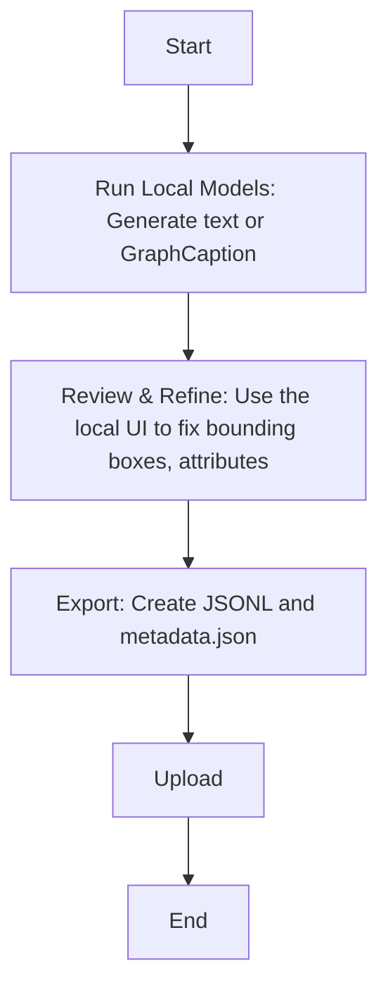
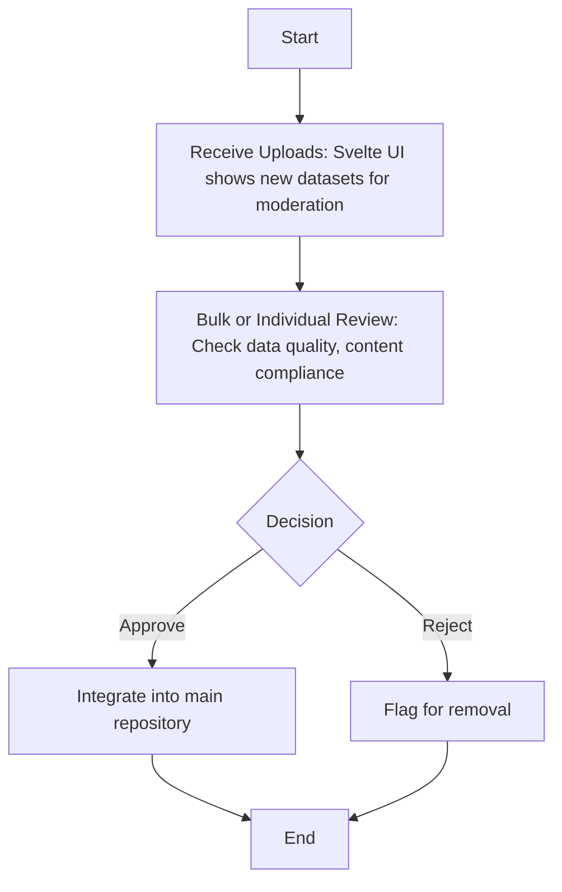

[link](https://github.com/Open-Model-Initiative/OMI-Data-Pipeline/issues/134)
Pulled 1/22/2025

# [RFC] OMI Distributed Captioning System Architecture


**Created:** 1/16/2025  

## Table of Contents
1. [Summary & Overview](#1-summary--overview)
2. [Background](#2-background)
3. [Proposal](#3-proposal)
4. [System Components](#4-system-components)
5. [Data Model and Storage](#5-data-model-and-storage)
6.  [Export and Upload Process](#6-export-and-upload-process)
7.  [Quality Attributes](#7-quality-attributes)
8. [Implementation Strategy](#8-implementation-strategy)
9.  [User Flow](#9-user-flow)
10. [Open Questions & Future Work](#10-open-questions--future-work)
11. [Out of Scope](#11-out-of-scope)

## 1. Summary & Overview

The **OMI Distributed Captioning System** is a platform that enables a community of contributors to collaboratively build a large, high-quality, open-source image caption dataset. The system combines local processing (for caption generation) with a centrally-managed backend (for secure uploads, moderation, and indexing) to support both simple text captions and more advanced scene-based annotations (GraphCaption). By decentralizing heavy computation to contributors’ local machines, it minimizes central infrastructure costs while enabling a robust, scalable, and flexible annotation pipeline.


## 2. Background

The **Open Model Initiative (OMI)** was founded to foster open-source AI models and datasets. A recurring challenge is constructing large, richly annotated image caption datasets. Centralized approaches place significant burdens on infrastructure while limiting community collaboration.

This distributed model addresses these concerns:
- **Local Contribution**: Contributors run captioning models with local or cloud-based GPU resources through openai compatible endpoints (vllm, ollama, openrouter, gemini, etc) and prepare their data for submission.
- **Structured or Unstructured**: Simple text-based captions can coexist with more complex scene-graph annotations (GraphCaption).
- **Moderation and Compliance**: A central repository enforces data quality and policies, ensuring that all contributions meet community guidelines.

### Abandoned Idea: One-Shot Graph Captions
- Early prototypes utilized a single high-end model to produce graph captions in one go. While effective, it demanded specialized hardware beyond normal consumer availability. This approach is shelved in favor of a more accessible, incremental pipeline.

### Glossary
| Term             | Definition                                                                                                                                                                |
|-----------------|---------------------------------------------------------------------------------------------------------------------------------------------------------------------------|
| **GraphCaption**  | A structured format for image annotations that includes nodes (objects, attributes) and edges (relationships between objects) to provide a detailed scene description. |
| **JSONL**         | A text format where each line is a valid JSON value. Commonly used for storing lists of structured data.                                                               |
| **JSONB**         | A binary JSON data type in PostgreSQL that allows for efficient storage and querying of JSON data.                                                                     |
| **GIN Index**     | Generalized Inverted Index in PostgreSQL, particularly efficient for searching within JSONB data.                                                                    |
| **Perspective**   | A single view of an image, typically generated by a different model or approach.                                                                                |
| **Synthesizer** | A model that takes multiple perspectives and merges them into a single, coherent annotation.                                                                                |

## 3. Proposal

### 3.1 Architectural Overview

We propose a **hybrid architecture** featuring:
1. **Local Captioning Environment** – Where contributors generate captions (text or structured) and optionally refine them.  
2. **Central Repository (AWS-Hosted)** – Svelte UI for authentication, uploads, and moderation, backed by postgres.  
3. **GPU-Backed Processing Node** – Handles advanced tasks, such as merging multiple perspectives into a single GraphCaption and ViT validation.  
4. **UI-Driven Bulk Uploads** – Prevents direct public writes to the database and ensures secure, moderated data ingestion.

### 3.2 Architectural Principles

- **Modularity & Extensibility**: Multiple models, easy to swap or add new “perspectives.”  
- **Enhanced Handling of Complexity**: Existing Text-based captions remain easy; advanced scene-graph data can be stored in the same structure.  
- **Security & Compliance**: Authenticated uploads, moderation pipeline, short-lived tokens.  
- **Interoperability & Standardization**: Use JSONL for export, GraphCaption stored in JSONB, minimal schema changes.  

### 3.3 Perspectives-Based Captioning

To further enrich caption diversity and quality, the system utilizes a "perspectives" approach. Rather than relying on a single, all-encompassing caption, contributors can generate multiple captions for each image, with each focusing on different aspects or styles. This strategy directly addresses several objectives. It distributes the computational workload through multiple, focused captioning passes, enabling contributions from a wider range of hardware capabilities. It also allows the capture of specific image attributes, such as style, format, and object focus, leading to more granular and targeted annotations. Additionally, by decoupling caption aspects, the system leverages efficient batch inference techniques like vLLM to improve processing throughput.


## 4. System Components

### 4.1 Local Captioning Environment

- **OpenAI API compatible Inference**: Allows flexibility in captioning providers (Pixtral, Qwen, JoyCap, etc.).
- **Specialized Model Containers**: For synthesizer and graph-caption stages if local hardware permits.
- **Local UI**: Handles image upload, caption generation, preview, editing, and pre-validation of data before export.
- **Outputs**: Standard JSONL for easy packaging; images optionally uploaded to a HuggingFace dataset.
- **Resource Requirements**:

| Usage Level | Hardware Requirements | Notes |
|------------|----------------------|--------|
| Basic Captioning | 8GB-24GB VRAM GPU or CPU-only | Suitable for most consumer GPUs, CPU is slower |
| Advanced Processing | ~48GB VRAM (A6000 or similar) | Can delegate to OMI resources if needed |

### 4.2 Central Repository Backend (FastAPI)

- **Data Ingestion**: Receives validated uploads, references them in Postgres.
- **Moderation & Indexing**: Provides endpoints for the moderation UI, possible integration with GPU node for advanced queries.
- **User Management**: Manages roles, authentication, rate limits, and upload tokens.

### 4.3 GPU-Backed Processing Node

- **Advanced or Compute-Heavy Tasks**: Multi-perspective caption fusion, graph expansion, embeddings.
- **Scalability**: Can run multiple GPU instances. A queue system manages job distribution.
- **Integration**: Submits results back to Postgres or S3 for the central UI to retrieve.

### 4.4 Frontend (Svelte UI)

- **Central UI**: Authenticated uploads, moderation tools.

### 4.5 Database Layer (Postgres)

- **Annotation Storage**: JSONB field for storing both simple text captions and GraphCaption data.
- **Indexes**: Potential GIN indexes on JSONB for performance.

## 5. Data Model and Storage

### 5.1 Annotation Model

We will leverage the existing annotation model and the annotation field for storing the graph captions. The graph caption data will be stored as a structured json object within the annotation field. Version strings will be included to manage schema migrations over time. Postgres 17 updates to performance within JSONB structures mitigate most concerns we would traditionally have with the use of this datatype. 

```python
class Annotation(Base):
    __tablename__ = "annotations"

    id = Column(Integer, primary_key=True, index=True)
    content_id = Column(Integer, ForeignKey("contents.id"), nullable=False)
    annotation = Column(JSON) # Convert to JSONB during Postgres 17 upgrade
    manually_adjusted = Column(Boolean, default=False)
    overall_rating = Column(Float, nullable=True)
    from_user_id = Column(Integer, ForeignKey("users.id"), nullable=True)
    from_team_id = Column(Integer, ForeignKey("teams.id"), nullable=True)
    created_at = Column(DateTime(timezone=True), server_default=func.now())
    updated_at = Column(DateTime(timezone=True), onupdate=func.now())

    content = relationship("Content", back_populates="annotations")
    from_user = relationship("User", back_populates="annotations")
    from_team = relationship("Team", back_populates="annotations")
    annotation_sources = relationship(
        "AnnotationSource",
        secondary="annotation_sources_link",
        back_populates="annotations",
    )
    embeddings = relationship("AnnotationEmbedding", back_populates="annotation")
    ratings = relationship("AnnotationRating", back_populates="annotation")
    reports = relationship("AnnotationReport", back_populates="annotation")
```


### 5.2 GraphCaption Format

The GraphCaption format provides a rich structure for describing image contents through interconnected nodes and relationships. Each annotation consists of both required and optional fields that together create a comprehensive scene description.

**Validation Rules:**

| Field | Requirement | Constraints |
|-------|-------------|------------|
| type | Required | Must be "GraphCaption" |
| version | Optional | String for schema versioning |
| nodes | Required | Array, max 50 nodes |
| edges | Optional | Must reference valid node IDs |
| simple_caption | Optional | Text summary |
| detailed_caption | Optional | Longer description |

**Fields**  
- **type** (required): Always `"GraphCaption"`.  
- **version** (optional): String for future schema evolution.  
- **nodes** (required array): Each node must have `id`, `type`, `class`; optional fields `attributes`, `bounding_box`, `confidence`.  
- **edges** (optional array): Directed relationships with `source_node_id`, `target_node_id`, `relation_type`.  
- **simple_caption** (optional): Short textual summary.  
- **detailed_caption** (optional): Longer narrative or thorough description.

**Validation & Limits**  
- Up to **50 nodes** per annotation.  
- Strict checks for referencing valid node IDs, bounding boxes, confidence ranges.

**Example**  
```json
{
  "type": "GraphCaption",
  "version": "v1",
  "nodes": [
    {
      "id": "obj1",
      "type": "object",
      "class": "Person",
      "attributes": ["red-shirt", "smiling"],
      "bounding_box": [100, 50, 150, 300],
      "confidence": 0.95
    }
  ],
  "edges": [
    {
      "source_node_id": "obj1",
      "target_node_id": "obj2",
      "relation_type": "holding",
      "confidence": 0.88
    }
  ]
}

```

### 6. Export and Upload Process

#### 6.1 Local Packaging

* **JSONL Files**: Each line represents one image annotation (text or GraphCaption).
* **Metadata JSON**: Includes dataset location, version information, and file hash.
* **Images**: Stored in HuggingFace datasets or remote URLs for retrieval.

#### 6.2 UI-Driven Upload

* **Authentication**: User logs in using existing auth systems. 
* **Batch Uploads**: Supports up to approximately 1GB per request (configurable). Larger sets use multi-part or chunked uploads.
* **Integrity Checks**: The backend verifies the JSON schema, bounding boxes, and file hash.

#### 6.3 Moderation Pipeline

* **Bulk Moderation Tools**: Allows for the approval or rejection of entire sets or individual records.
* **Quality & Compliance**:
	+ **Minimum Criteria**: Must have a valid license per OMI data rights requirements and not violate OMI Content Policy.
	+ **Optional Advanced Checks**: Includes ML-based filters for adversarial or suspicious images.
* **Dispute Handling**: Contributors can request a re-review. Final decisions rest with the moderation team.

### 7. Quality Attributes

**Performance & Scalability**
The system achieves horizontal scalability through FastAPI's autoscaling capabilities, allowing multiple replicas behind a load balancer. For computation-intensive tasks, GPU nodes can be scaled to meet demand spikes.

**Reliability**
We ensure data durability through AWS deployment and automated backups. The stateless nature of our containers enables seamless redeployment of both backend and UI components.

#### 7.1 Performance & Scalability
* GPU Nodes: Could set up system to scale horizontally on cloud provider (currently Runpod) if there is a surge in advanced tasks.

#### 7.2 Reliability
* Stateless Containers: Both backend and UI can be redeployed seamlessly.

#### 7.3 Security
* Rate Limiting & Role-Based Access: Deters abuse or spam uploads.
* File-Type Validation & Virus Scanning: Ensures no malicious content is introduced.
* Automated ML Filters: Potential for detecting adversarial images or policy violations.

#### 7.4 Maintainability

* Modular Pipeline: Easy to swap or add new models and annotation types.
* Incremental Schema: GraphCaption is embedded in the same JSON field, requiring no major DB overhauls.


### 8. Implementation Strategy

The system implementation consists of four main components, each with distinct responsibilities and integration points:

#### 8.1 Backend Services

| Component | Key Features | Technical Details |
|-----------|--------------|-------------------|
| Database Layer | • Data Persistence<br>• Query Optimization | • Postgres 17 with JSONB<br>• GIN indexes for annotation search<br>• Partitioning for large datasets |
| GPU Processing | • Async Task Processing<br>• Resource Management | • Queue-based architecture<br>• Auto-scaling worker pools<br>• Result persistence strategy |

#### 8.2 Local Environment

The contributor environment is delivered as a Docker container with the following architecture:

| Layer | Components |
|-------|------------|
| Interface | • Web UI for caption editing<br>• CLI for batch operations |
| Processing | • Model inference <br>• Local validation suite |
| Export | • JSONL generation<br>• Metadata packaging<br>• Upload utilities |

#### 8.3 Integration Points

Critical system interactions include:

| Integration | Purpose | Implementation |
|-------------|---------|----------------|
| Local → Backend | Dataset submission | • Chunked uploads<br>• Validation handshake<br>• Progress tracking |
| Backend → GPU | Processing requests | • Task queue integration<br>• Resource allocation<br>• Result aggregation |
| UI → Backend | Moderation workflow | • Real-time updates<br>• Bulk operations<br>• Audit logging |

#### 8.4 Deployment Strategy

The system will be deployed in phases:

1. **Alpha Release** (Phase 1)

| Component | Features |
|-----------|----------|
| Local | • Image Upload <br>• Perspective Captions<br>• HuggingFace Dataset Export<br>• Jsonl Export |
| Central UI | • Jsonl upload |

2. **Beta Release** (Phase 2)
   - GPU processing integration
   - Enhanced validation
   - Advance Moderation features

3. **Production Release** (Phase 3)
   - Full feature set
   - Performance optimization
   - Production monitoring

### 9. User Flow

#### 9.1 Contributors

* Run Local Models: Generate text or GraphCaption.
* Review & Refine: Use the local UI to fix bounding boxes, attributes.
* Export: Create JSONL and metadata.json, then upload.

#### 9.2 Moderators

* Receive Uploads: Svelte UI shows new datasets for moderation.
* Bulk or Individual Review: Check data quality, content compliance.
* Approve or Reject: Final submission gets integrated or flagged for removal.


### 10. QA / Open Questions
#### QA 

> How should we handle the moderation process?

 A standardized evaluation framework should be established to guide moderators in assessing submissions while maintaining sufficient flexibility for exceptional cases. This balanced approach enables consistent quality control while allowing moderators' expertise to inform and improve evaluation criteria over time.

> How should we handle the appeals process? 
Appeals should be handled through established communication channels (email or Discord) rather than building dedicated application functionality. This approach:

1. Leverages existing infrastructure
2. Facilitates direct communication between moderators and contributors
3. Allows for nuanced discussion and resolution
4. Reduces development overhead
5. Maintains flexibility in the appeals process

The specific process should be documented in the contributor guidelines, including:
- Primary point of contact
- Expected response times
- Required information for appeals
- Possible outcomes

#### Open Questions
- Do we need to utilize the fastapi at all here or will the svelte backend be sufficient?

##### Moderation UX 
- How will we handle viewing the images in the app for moderation ux when it is stored in the HF dataset? 
##### GPU Node

- How to manage GPU resources (autoscaling, job scheduling)?
- Handling queue backlogs, job prioritization, metrics?

##### Security & Rate Limiting
- Policy for banning or revoking access on repeated malicious uploads?


##### Offline or Partial Upload
- Could the local UI handle incremental, offline preparations of data before final sync?

#### 11. Out of Scope
- General Database Backup: Standard AWS backups or external solutions apply but are not covered here in detail.
- Comprehensive Disaster Recovery: The system expects standard cloud practices but does not define them in this RFC.
- Detailed API Documentation: Will be addressed separately, likely via an OpenAPI/Swagger specification.

