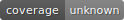
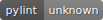
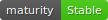

======
Redner
======

.. |license| image:: .badges/licence-AGPL--3-blue.svg
    :target: http://www.gnu.org/licenses/agpl-3.0-standalone.html
    :alt: License: AGPL-3

.. |prettier| image:: .badges/code_style-prettier-ff69b4.svg
    :target: https://github.com/prettier/prettier
    :alt: Prettier

|coverage| |pylint| |maturity| |license| |ruff| |prettier|

Produce reports & emails with Rednerd_.

Rednerd_ is an innovative solution to produce transactional emails
and documents in PDF or HTML format.

It's designed to help applications or websites that need to send transactional
email like password resets, order confirmations, and welcome messages.

Rednerd_ offers advanced tracking, easy-to-understand reports & email
templates.
This Module allow you to use email template designed with mailjet app
(languages uses in template must be mjml or mustache) which you can add
in odoo template.
It also allows the rendering of documents in pdf or html format.

Configure this module using the following ``ir.config_parameter``::

    redner.server_url = http://dockerhost:7000
    redner.api_key = <your API key here>
    redner.account = <your account name>
    redner.timeout = 20

``redner.timeout`` is in seconds; defaults to 20 seconds per redner call.

**Pro tip**: You can use mjml-app_ to prototype your email templates.

UI Changes
----------

* Setting > Redner > Templates

Note: When you have existing templates you want to register onto a new
redner server (or with a new user), multi-select them and click
"Send to redner server".

.. _mjml-app: http://mjmlio.github.io/mjml-app/
.. _Rednerd: https://orus.io/orus-io/rednerd
